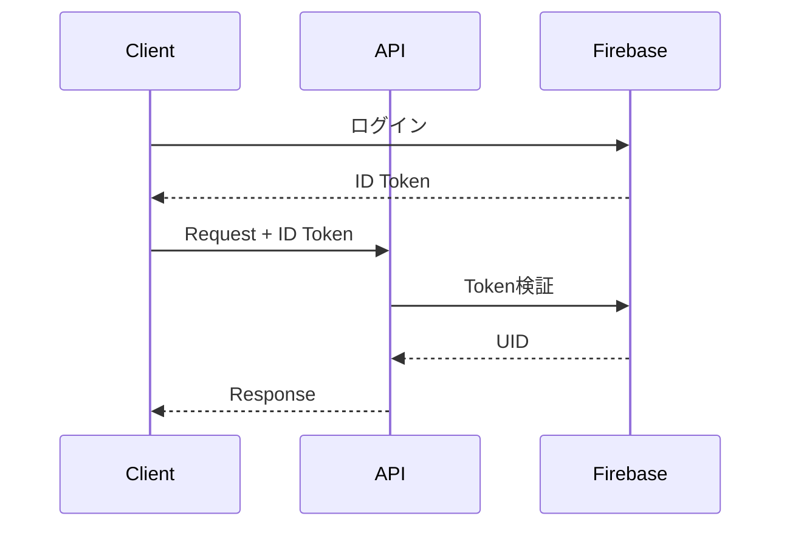

# API設計

## API設計原則

### RESTful原則

- **リソースベース**: URLはリソース（名詞）で表現し、動詞は使用しない
- **HTTPメソッド**: 操作の意図を明確に表現
  - GET: リソース取得（冪等）
  - POST: リソース作成
  - PUT: リソース更新（冪等）
  - DELETE: リソース削除（冪等）
- **ステートレス**: リクエスト間で状態を保持しない
- **統一インターフェース**: 一貫性のあるAPI設計

### 命名規則

- **エンドポイント**: 複数形を使用 (`/users`, `/matches`)
- **パスパラメータ**: ケバブケースを使用 (`/match-requests`)
- **クエリパラメータ**: キャメルケースを使用 (`?minAge=20`)
- **バージョニング**: URLに含める (`/api/v1/...`)

### 設計指針

- **最小権限の原則**: ユーザーは必要最小限のデータにのみアクセス可能
- **防御的プログラミング**: すべての入力は信頼せず、バリデーションを実施
- **明示的なエラー**: エラーメッセージは具体的かつセキュアに
- **後方互換性**: 破壊的変更はバージョンアップで対応

---

## レスポンス設計

### 成功レスポンス形式

**単一リソース:**
```json
{
  "id": "uuid",
  "name": "山田太郎",
  "email": "user@example.com"
  // その他のフィールド
}
```

**コレクション (リスト):**
```json
{
  "data": [/* リソースの配列 */],
  "meta": {
    "total": 100,
    "page": 1,
    "limit": 20,
    "totalPages": 5
  }
}
```

### エラーレスポンス形式

統一されたエラーレスポンス構造により、クライアント側でのエラーハンドリングを容易にします。

```json
{
  "error": {
    "code": "VALIDATION_ERROR",
    "message": "Invalid input",
    "details": [
      {
        "field": "email",
        "message": "Email is required"
      }
    ]
  }
}
```

### HTTPステータスコード使用基準

| コード | 意味 | 使用場面 |
|-------|------|--------|
| 200 | OK | GET, PUT成功 |
| 201 | Created | POST成功（リソース作成） |
| 204 | No Content | DELETE成功 |
| 400 | Bad Request | バリデーションエラー |
| 401 | Unauthorized | 認証エラー（トークン無効等） |
| 403 | Forbidden | 権限エラー（認証済みだが権限不足） |
| 404 | Not Found | リソースが存在しない |
| 409 | Conflict | リソースの競合（重複等） |
| 422 | Unprocessable Entity | 処理できないエンティティ |
| 429 | Too Many Requests | レート制限超過 |
| 500 | Internal Server Error | サーバーエラー |

### エラーコード体系

アプリケーション固有のエラーを識別するための標準コード：

| コード | 説明 | HTTPステータス |
|-------|------|---------------|
| `VALIDATION_ERROR` | バリデーションエラー | 400 |
| `AUTHENTICATION_ERROR` | 認証エラー | 401 |
| `AUTHORIZATION_ERROR` | 認可エラー | 403 |
| `NOT_FOUND` | リソースが見つからない | 404 |
| `ALREADY_EXISTS` | リソースが既に存在する | 409 |
| `RATE_LIMIT_EXCEEDED` | レート制限超過 | 429 |
| `INTERNAL_ERROR` | 内部エラー | 500 |

---

## 認証・認可

### 認証方式

Firebase ID Tokenを使用したBearer認証

**リクエストヘッダー:**
```
Authorization: Bearer <firebase-id-token>
```

### 認証フロー



---

## バリデーション戦略

### リクエストバリデーション

**ライブラリ選定**: Zod

**選定理由**:
- TypeScriptとの親和性が高い
- スキーマから型推論が可能
- エラーメッセージのカスタマイズが容易
- Nuxt 3との統合が簡単

**バリデーション方針**:
- すべてのPOST/PUTリクエストで実施
- クエリパラメータも必要に応じてバリデーション
- バリデーションエラーは詳細な情報を返す
- サーバーサイドで必ず実施（クライアントバリデーションは補助的）

**実装パターン**:
```typescript
// Zodスキーマでバリデーション定義
const schema = z.object({
  email: z.string().email(),
  age: z.number().int().min(18).max(120)
})

// バリデーション失敗時は400エラー
// 成功時は型安全な値を取得
```

---

## ページネーション方針

### 方式の使い分け

**カーソルベースページネーション**:
- **使用場面**: リアルタイム性の高いデータ（チャットメッセージ等）
- **利点**: 高速、新規データ追加時の整合性が保たれる
- **パラメータ**: `cursor`, `limit`
- **レスポンス**: `nextCursor`, `hasMore`

**オフセットベースページネーション**:
- **使用場面**: 静的な一覧表示（ユーザー検索等）
- **利点**: ページジャンプが可能、総数が分かる
- **パラメータ**: `page`, `limit`
- **レスポンス**: `total`, `page`, `limit`, `totalPages`

### デフォルト値

- `limit`: 20（最大100）
- `page`: 1

---

## レート制限ポリシー

### 目的

- DDoS攻撃からの保護
- リソースの公平な配分
- スパム行為の防止

### 制限値の設定基準

| エンドポイント種別 | 制限値 | 理由 |
|--------------|------|------|
| 認証API | 10回/分 | ブルートフォース攻撃防止 |
| 書き込みAPI | 100回/時間 | スパム的なリクエスト防止 |
| リアルタイムAPI | 1000回/時間 | リアルタイム通信の必要性考慮 |
| その他 | 300回/5分 | 通常利用に支障がない範囲 |

### 実装方式

- IPアドレスベース + ユーザーIDベース
- Redis等のインメモリストアで管理
- レスポンスヘッダーで残り回数を通知

**標準ヘッダー**:
```
X-RateLimit-Limit: 100
X-RateLimit-Remaining: 95
X-RateLimit-Reset: 1634567890
```

### 制限超過時の対応

- HTTPステータス: `429 Too Many Requests`
- エラーコード: `RATE_LIMIT_EXCEEDED`
- `retryAfter`（秒）を返却

---

## WebSocket API設計

### 使用場面

- リアルタイムチャット
- プッシュ通知
- オンラインステータス
- 入力中インジケーター

### 認証方式

WebSocket接続時にFirebase ID Tokenを使用:
```javascript
const socket = io('wss://api.example.com', {
  auth: { token: firebaseIdToken }
})
```

### イベント設計原則

| イベント種別 | 命名規則 | 例 |
|---------|------|------|
| クライアント→サーバー | 動詞_名詞 | `send_message`, `join_chat` |
| サーバー→クライアント | 形容詞_名詞 | `new_message`, `user_online` |
| 双方向 | 状態_名詞 | `typing_status`, `read_status` |

### 主要イベント

| イベント | 方向 | 説明 |
|---------|------|------|
| `join_chat` | Client → Server | チャットルーム参加 |
| `leave_chat` | Client → Server | チャットルーム退出 |
| `send_message` | Client → Server | メッセージ送信 |
| `new_message` | Server → Client | 新着メッセージ |
| `user_typing` | Both | 入力中通知 |
| `message_read` | Both | 既読通知 |

### エラーハンドリング

WebSocketでもREST APIと同様のエラー構造を使用:
```javascript
socket.on('error', (error) => {
  // { code: 'ERROR_CODE', message: '...' }
})
```

---

## APIバージョニング戦略

### バージョン管理方針

- **URL方式**: `/api/v1/...` の形式でバージョンを含める
- **メジャーバージョンのみ**: 破壊的変更時のみバージョンアップ
- **サポート期間**: 最低2バージョンは同時サポート
- **移行期間**: 最低3ヶ月の猶予期間を設ける

### 破壊的変更の定義

以下の変更は新バージョンとして扱う:
- レスポンス構造の大幅な変更
- 必須パラメータの追加
- エンドポイントの削除
- 認証方式の変更

### 非推奨化プロセス

1. 新バージョンリリース
2. 旧バージョンに非推奨ヘッダー追加
   ```
   Deprecation: true
   Sunset: Sat, 31 Dec 2025 23:59:59 GMT
   ```
3. 3ヶ月の移行期間
4. 旧バージョン削除

---

## 詳細なAPI仕様書

実装されたAPIの詳細仕様は、コードから自動生成されます。

### 自動生成ドキュメント

- **生成先**: `docs/architecture/api/`
- **フォーマット**: OpenAPI 3.0 (JSON/YAML)
- **閲覧用UI**: [Scalar UI](http://localhost:3000/api/_scalar)
- **更新方法**: `npm run docs:api`

### ドキュメントに含まれる情報

- 全エンドポイント一覧
- リクエスト/レスポンススキーマ
- パラメータ定義（パス、クエリ、ボディ）
- 認証要件
- サンプルリクエスト/レスポンス
- Try it out 機能

### 運用ルール

- API実装時は必ずJSDocとTypeScript型を記述
- 実装完了後に `npm run docs:api` で仕様書を更新
- 手動でAPI仕様書を編集しない（コードが唯一の真実の情報源）

---

## 参考資料

- [REST API Design Best Practices](https://restfulapi.net/)
- [OpenAPI Specification](https://swagger.io/specification/)
- [Nuxt 3 Server API](https://nuxt.com/docs/guide/directory-structure/server)
- [Zod Documentation](https://zod.dev/)
