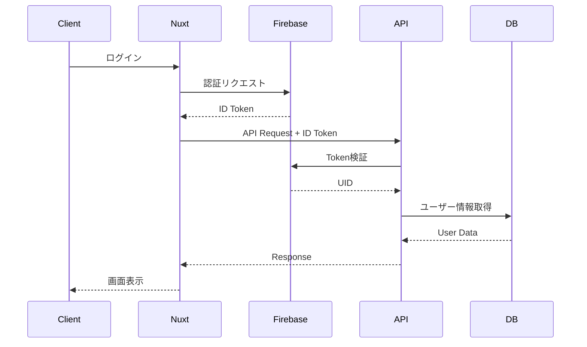

# システム設計

## システム全体構成図

```
┌─────────────────────────────────────────┐
│         クライアント (Nuxt3)             │
│  ┌─────────────────────────────────┐   │
│  │  Pages (画面)                    │   │
│  └──────────┬──────────────────────┘   │
│             │                           │
│  ┌──────────▼──────────────────────┐   │
│  │  Components (UI部品)            │   │
│  └──────────┬──────────────────────┘   │
│             │                           │
│  ┌──────────▼──────────────────────┐   │
│  │  Composables (ロジック)         │   │
│  └──────────┬──────────────────────┘   │
│             │                           │
│  ┌──────────▼──────────────────────┐   │
│  │  Stores (状態管理/Pinia)        │   │
│  └──────────┬──────────────────────┘   │
└─────────────┼───────────────────────────┘
              │ HTTP/WebSocket
┌─────────────▼───────────────────────────┐
│      サーバーサイド (Nitro)              │
│  ┌─────────────────────────────────┐   │
│  │  API Routes (server/api/)       │   │
│  └──────────┬──────────────────────┘   │
│             │                           │
│  ┌──────────▼──────────────────────┐   │
│  │  Middleware (認証・バリデーション)│   │
│  └──────────┬──────────────────────┘   │
│             │                           │
│  ┌──────────▼──────────────────────┐   │
│  │  Database Layer (Prisma)        │   │
│  └──────────┬──────────────────────┘   │
└─────────────┼───────────────────────────┘
              │
┌─────────────▼───────────────────────────┐
│         外部サービス                      │
│  - PostgreSQL                           │
│  - Redis (キャッシュ)                    │
│  - Firebase Authentication              │
│  - S3 (ファイルストレージ)               │
└─────────────────────────────────────────┘
```

---

## 技術スタック

### フロントエンド

| レイヤー | 技術 | 用途 |
|---------|------|------|
| フレームワーク | Nuxt 3 | SSR/SPA、ルーティング |
| UI フレームワーク | Tailwind CSS | スタイリング |
| 状態管理 | Pinia | グローバル状態管理 |
| バリデーション | Zod | フォームバリデーション |
| HTTP クライアント | $fetch (ofetch) | API通信 |

### バックエンド

| レイヤー | 技術 | 用途 |
|---------|------|------|
| サーバー | Nitro (Nuxt内蔵) | APIサーバー |
| ORM | Prisma | データベース操作 |
| 認証 | Firebase Admin SDK | ユーザー認証 |
| バリデーション | Zod | リクエストバリデーション |
| キャッシュ | Redis | セッション、キャッシュ |

### インフラ

| サービス | 用途 |
|---------|------|
| Vercel / AWS | ホスティング |
| PostgreSQL | メインデータベース |
| Redis | キャッシュ層 |
| S3 | ファイルストレージ |
| CloudFront | CDN |
| Firebase Auth | ユーザー認証 |

---

## レイヤーアーキテクチャ

### プレゼンテーション層 (Pages/Components)

**責務:**
- ユーザーインターフェースの表示
- ユーザーインタラクションの処理
- ビジネスロジック層への委譲

**主要ディレクトリ:**
- `pages/` - ルーティングベースのページコンポーネント
- `components/` - 再利用可能なUIコンポーネント
- `layouts/` - ページレイアウト

**実装例:**
```vue
<!-- pages/users/index.vue -->
<script setup lang="ts">
const { users, loading } = useUsers()
</script>

<template>
  <div>
    <UserList :users="users" :loading="loading" />
  </div>
</template>
```

---

### ビジネスロジック層 (Composables/Stores)

**責務:**
- ビジネスロジックの実装
- 状態管理
- API呼び出しの抽象化

**主要ディレクトリ:**
- `composables/` - Composition API関数
- `stores/` - Pinia ストア

**実装例:**
```typescript
// composables/useUsers.ts
export const useUsers = () => {
  const users = ref<User[]>([])
  const loading = ref(false)

  const fetchUsers = async () => {
    loading.value = true
    try {
      const data = await $fetch<User[]>('/api/users')
      users.value = data
    } finally {
      loading.value = false
    }
  }

  return { users, loading, fetchUsers }
}
```

---

### データアクセス層 (Server API/Prisma)

**責務:**
- データベース操作
- 外部APIとの連携
- データの永続化

**主要ディレクトリ:**
- `server/api/` - APIエンドポイント
- `server/utils/` - サーバーユーティリティ
- `prisma/` - データベーススキーマ

**実装例:**
```typescript
// server/api/users/index.get.ts
import { PrismaClient } from '@prisma/client'

const prisma = new PrismaClient()

export default defineEventHandler(async () => {
  return await prisma.user.findMany({
    include: { profile: true }
  })
})
```

---

## 認証フロー



### 認証ミドルウェア構成

1. **認証ミドルウェア** (`server/middleware/auth.ts`)
   - Firebase ID Tokenの検証
   - ユーザー情報のコンテキスト設定

2. **権限チェックミドルウェア** (`server/middleware/permission.ts`)
   - リソースへのアクセス権限確認

3. **バリデーションミドルウェア** (`server/middleware/validate.ts`)
   - リクエストボディのバリデーション

**実装例:**
```typescript
// server/middleware/auth.ts
import { getAuth } from 'firebase-admin/auth'

export default defineEventHandler(async (event) => {
  const token = getHeader(event, 'authorization')?.replace('Bearer ', '')

  if (!token) {
    throw createError({
      statusCode: 401,
      message: 'Unauthorized'
    })
  }

  try {
    const decodedToken = await getAuth().verifyIdToken(token)
    event.context.user = decodedToken
  } catch (error) {
    throw createError({
      statusCode: 401,
      message: 'Invalid token'
    })
  }
})
```

---

## パフォーマンス最適化

### フロントエンド

- コンポーネントの遅延ロード (`defineAsyncComponent`)
- 画像の最適化 (`nuxt/image`)
- Virtual Scrolling (大量データ表示)
- Pinia でのデータキャッシュ

### バックエンド

- Redisによるクエリキャッシュ
- データベースインデックスの最適化
- N+1問題の解消 (Prisma include)
- ページネーション実装

### キャッシュ戦略

| データ種別 | キャッシュ場所 | TTL |
|----------|--------------|-----|
| ユーザープロフィール | Redis | 5分 |
| マスターデータ | Redis | 1時間 |
| 静的アセット | CDN | 1年 |
| API レスポンス | ブラウザキャッシュ | 1分 |

---

## スケーラビリティ

### 水平スケーリング

- Vercel の自動スケーリング
- RDS Read Replica (読み取り負荷分散)
- Redis Cluster (キャッシュ分散)

### 負荷分散戦略

```
        ┌─────────────┐
        │   CDN       │
        └──────┬──────┘
               │
        ┌──────▼──────┐
        │ Load Balancer│
        └──────┬──────┘
               │
     ┌─────────┼─────────┐
     ▼         ▼         ▼
┌────────┐ ┌────────┐ ┌────────┐
│Server 1│ │Server 2│ │Server 3│
└────┬───┘ └────┬───┘ └────┬───┘
     │          │          │
     └──────────┼──────────┘
                ▼
         ┌──────────────┐
         │  Database    │
         │  (Primary)   │
         └──────┬───────┘
                │
         ┌──────┴───────┐
         ▼              ▼
    ┌────────┐     ┌────────┐
    │Replica1│     │Replica2│
    └────────┘     └────────┘
```

---

## 監視・ログ

### 監視項目

- エラー率 (Sentry)
- レスポンスタイム (Vercel Analytics)
- データベース負荷 (CloudWatch)
- ユーザーアクティビティ (Google Analytics)

### ログ設計

```typescript
// 構造化ログ
interface LogEntry {
  timestamp: string
  level: 'info' | 'warn' | 'error'
  service: string
  userId?: string
  action: string
  metadata?: Record<string, any>
  error?: Error
}

// 使用例
logger.info({
  service: 'api',
  userId: 'xxx',
  action: 'user_created',
  metadata: { email: 'user@example.com' }
})
```

---

## 環境構成

### 開発環境
- ローカルPostgreSQL
- ローカルRedis
- Firebase Emulator

### ステージング環境
- Vercel Preview
- RDS (開発用)
- ElastiCache

### 本番環境
- Vercel Production
- RDS (本番用、Multi-AZ)
- ElastiCache (Cluster Mode)
- CloudFront + S3

---

## API バージョニング

将来的なAPI変更に備えたバージョニング戦略:

```
/api/v1/users      # Version 1
/api/v2/users      # Version 2 (breaking changes)
```

**実装方針:**
- メジャーバージョンアップ時のみURLを変更
- マイナーアップデートは後方互換性を保つ
- 最低2バージョンはサポート維持
