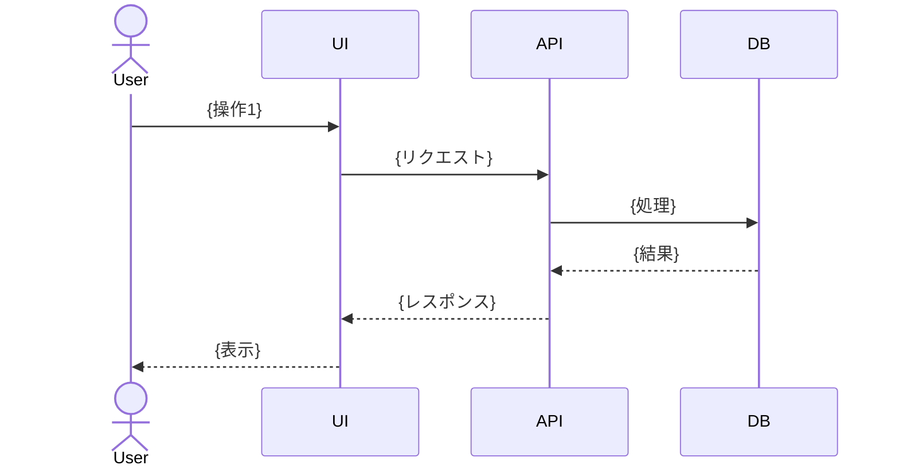

# {画面名}

## 基本情報

| 項目 | 内容 |
|------|------|
| ステータス | 作成中 / レビュー中 / 確定 |
| 作成日 | YYYY-MM-DD |
| 更新日 | YYYY-MM-DD |
| 担当者 | - |

---

## 1. 概要

### 目的

{この画面が提供する価値・目的を記載}

### 対象ユーザー

- {対象ユーザー1}
- {対象ユーザー2}

---

## 2. 機能一覧

| ID | 機能名 | 説明 | 優先度 |
|----|--------|------|--------|
| FR-{CODE}-001 | {機能名} | {説明} | 必須/重要/任意 |
| FR-{CODE}-002 | {機能名} | {説明} | 必須/重要/任意 |

---

## 3. 画面構成

### レイアウト

{画面のレイアウト構成を説明}

```
+------------------+------------------+------------------+
|                  |                  |                  |
|   {エリア1}       |   {エリア2}       |   {エリア3}       |
|                  |                  |                  |
+------------------+------------------+------------------+
```

### 主要コンポーネント

| コンポーネント | 役割 |
|--------------|------|
| {Component1} | {役割} |
| {Component2} | {役割} |

---

## 4. 操作フロー

### 基本フロー: {フロー名}



**手順:**

1. ユーザーが {操作1} を行う
2. システムが {処理1} を実行する
3. {結果1} が表示される

### 代替フロー: {フロー名}

{代替フローがある場合は記載}

---

## 5. 入出力仕様

### 入力項目

| 項目 | 型 | 必須 | バリデーション | 備考 |
|------|-----|------|---------------|------|
| {項目1} | string | Yes | {ルール} | {備考} |
| {項目2} | number | No | {ルール} | {備考} |

### 出力・表示

| 状態 | 表示内容 |
|------|---------|
| 成功時 | {表示内容} |
| エラー時 | {エラーメッセージ} |
| ローディング時 | {表示内容} |

---

## 6. 非機能要件

### パフォーマンス

| 項目 | 要件 |
|------|------|
| 応答時間 | {X}秒以内 |
| 同時処理数 | {N}件 |

### セキュリティ

| 項目 | 要件 |
|------|------|
| 認証 | {要件} |
| 認可 | {要件} |

### アクセシビリティ

| 項目 | 要件 |
|------|------|
| キーボード操作 | {対応状況} |
| スクリーンリーダー | {対応状況} |

---

## 7. エラーハンドリング

| エラー種別 | 原因 | ユーザーへの表示 | 対処方法 |
|-----------|------|-----------------|---------|
| {エラー1} | {原因} | {メッセージ} | {対処} |
| {エラー2} | {原因} | {メッセージ} | {対処} |

---

## 8. テストシナリオへのリンク

### E2Eテスト

- [{シナリオ名}](../../test/e2e/scenarios/{file}.md)

### 統合テスト

- [{シナリオ名}](../../test/integration/scenarios/{file}.md)

---

## 変更履歴

| 日付 | 版 | 変更内容 | 担当者 |
|------|-----|---------|--------|
| YYYY-MM-DD | 1.0 | 初版作成 | - |
